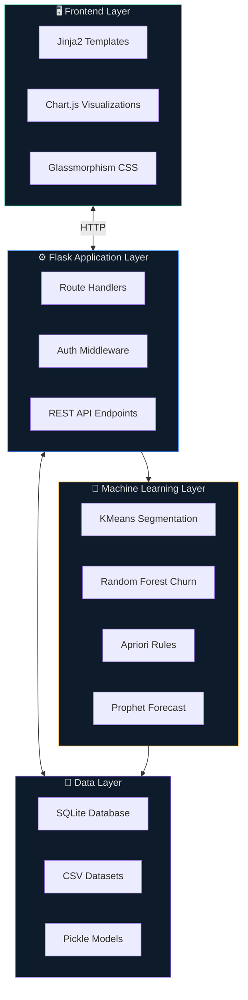
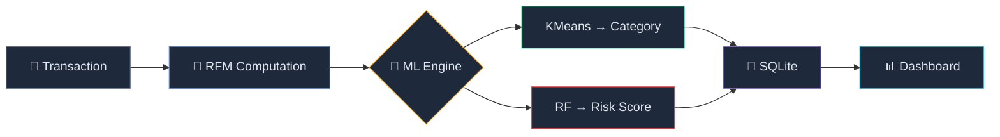
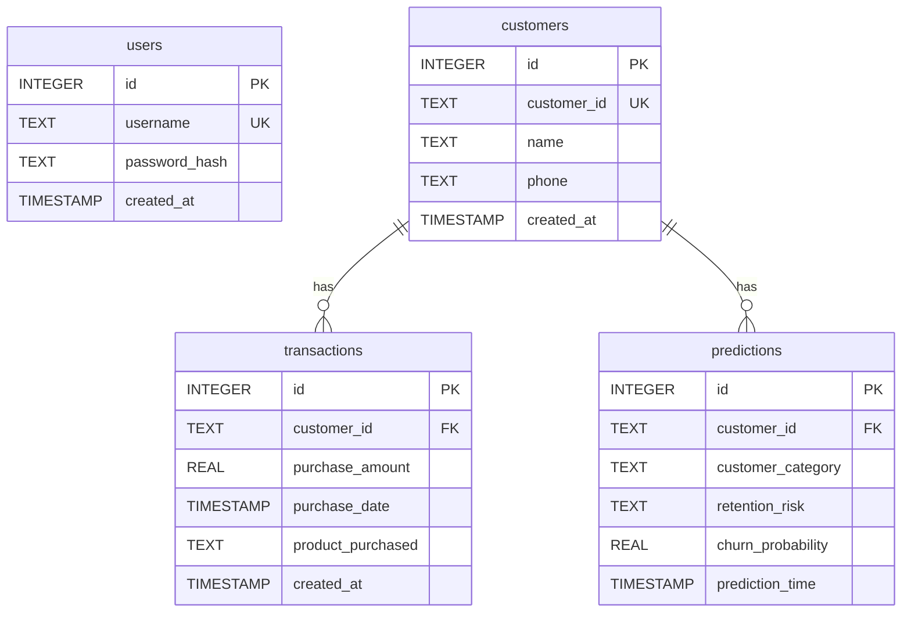

<div align="center">

<br>


<br>

### AI-Powered Retail Customer Analytics Platform

*Segment customers · Predict churn · Recommend products · Forecast revenue*
*All through a sleek dark-mode SaaS dashboard.*

<br>


<br>

<sub>Built with ❤️ as a portfolio-grade analytics platform — powered by the UCI Online Retail Dataset</sub>

</div>

<br>

---

<br>

## 🎯 What is RetailIQ?

RetailIQ is a **production-style retail analytics platform** that demonstrates end-to-end machine learning integration — from customer segmentation and churn prediction, to product recommendations and revenue forecasting — all surfaced through an interactive dark-mode dashboard with glassmorphism design.

> [!NOTE]
> All ML terminology is translated into **retailer-friendly language** in the UI. Business owners see "Customer Categories" instead of "KMeans Clusters" and "Retention Risk" instead of "Churn Probability."

<br>

## ✨ Key Features

<table>
<tr>
<td width="50%" valign="top">

#### 📊 Analytics & Intelligence
| Feature | Description |
|:--|:--|
| **Customer Segmentation** | KMeans clustering on RFM → VIP, Loyal, Regular, At Risk |
| **Churn Prediction** | Random Forest classifier → retention risk scoring |
| **Product Recommendations** | Apriori association rules → confidence & lift |
| **Revenue Forecasting** | Prophet time-series → daily forecast with CI |

</td>
<td width="50%" valign="top">

#### 🛠️ Platform Capabilities
| Feature | Description |
|:--|:--|
| **Customer CRM** | Full directory, profiles, search, & activity log |
| **Live Prediction** | Instant ML inference per customer |
| **Batch Upload** | CSV import → auto RFM + batch predictions |
| **Auth System** | Secure login/register with session management |

</td>
</tr>
</table>

<br>

## 🏗️ Architecture

<br>



<br>

### Prediction Pipeline

When a customer interaction is recorded, the system runs a structured inference pipeline:



<br>

## 🤖 ML Models

<br>

<table>
<tr>
<th>Model</th>
<th>Algorithm</th>
<th>Input Features</th>
<th>Output</th>
</tr>
<tr>
<td>

**Segmentation**

</td>
<td>KMeans (k=4) + StandardScaler</td>
<td>Recency, Frequency, Monetary</td>
<td>

`VIP` · `Loyal` · `Regular` · `At Risk`

</td>
</tr>
<tr>
<td>

**Churn**

</td>
<td>Random Forest Classifier</td>
<td>Frequency, Monetary, Revenue, Quantity, Products</td>
<td>

Probability → `High` · `Medium` · `Low` risk

</td>
</tr>
<tr>
<td>

**Recommendations**

</td>
<td>Apriori Association Rules</td>
<td>Transaction baskets</td>
<td>

Product pairs with confidence & lift

</td>
</tr>
<tr>
<td>

**Forecasting**

</td>
<td>Prophet Time-Series</td>
<td>Daily revenue series</td>
<td>

`ŷ` forecast with upper/lower bounds

</td>
</tr>
</table>

<br>

<details>
<summary><strong>🔧 Model Configuration Details</strong></summary>

<br>

**Cluster → Segment Mapping**
```python
{0: "Regular", 1: "At Risk", 2: "VIP", 3: "Loyal"}
```

**Segment → UI Label Translation**
```python
{
    "VIP":     "Best Customers",
    "Loyal":   "Repeat Customers",
    "Regular": "Standard Customers",
    "At Risk": "Customers You May Lose",
}
```

**Churn Risk Thresholds**
```python
probability >= 0.70  →  "High Retention Risk"
probability >= 0.40  →  "Medium Retention Risk"
probability  < 0.40  →  "Low Retention Risk"
```

</details>

<br>

## 📂 Project Structure

```
RetailIQ/
│
├── 📄 app.py                          ← Flask app — all routes & API endpoints
├── 📄 requirements.txt                ← Python dependencies
│
├── 🤖 models/
│   ├── kmeans.pkl                     ← Trained KMeans segmentation model
│   ├── scaler.pkl                     ← StandardScaler for RFM features
│   ├── churn_model.pkl                ← Random Forest churn classifier
│   └── forecast_model.pkl             ← Prophet training artifact
│
├── 📊 data/
│   ├── customer_segments.csv          ← Pre-computed customer segments
│   ├── customer_churn.csv             ← Churn labels + features
│   ├── recommendation_rules.csv       ← Apriori association rules
│   ├── sales_forecast.csv             ← Prophet forecast output
│   └── cluster_summary.csv            ← Cluster centroid summary
│
├── 🧰 utils/
│   ├── __init__.py
│   ├── database.py                    ← SQLite CRUD & user auth
│   ├── preprocessing.py               ← CSV loaders & RFM computation
│   ├── segmentation.py                ← KMeans inference + label mapping
│   ├── churn.py                       ← Random Forest inference + risk labels
│   ├── recommendation.py              ← Apriori rule lookup engine
│   └── forecasting.py                 ← Prophet data reader & summariser
│
├── 🎨 templates/                       ← 18 Jinja2 HTML templates
│   ├── base.html                      ← Master layout with sidebar
│   ├── index.html                     ← Public landing page
│   ├── login.html / register.html     ← Authentication pages
│   ├── dashboard.html                 ← KPI overview & charts
│   ├── segmentation.html              ← Customer categories explorer
│   ├── churn.html                     ← Retention risk analysis
│   ├── recommendations.html           ← Product pairing engine
│   ├── forecasting.html               ← Revenue forecast viewer
│   ├── customer_entry.html            ← Add customer / record purchase
│   ├── customers.html                 ← Customer directory
│   ├── customer_detail.html           ← Individual CRM profile
│   └── ...                            ← Search, history, top, upload, 404
│
├── 🎭 static/css/style.css            ← 28KB custom dark-mode stylesheet
│
├── 📖 docs/
│   ├── architecture.md                ← System design & data flow diagrams
│   ├── database_schema.md             ← SQLite table definitions
│   ├── api_reference.md               ← Internal REST API docs
│   └── userflow.md                    ← User journey documentation
│
└── 📓 notebooks/
    └── retail_customer_analytics.ipynb ← EDA, training & evaluation notebook
```

<br>

## 🗄️ Database Schema

The application uses SQLite with four core tables:



> [!TIP]
> RFM metrics (Recency, Frequency, Monetary) are computed **dynamically** from the `transactions` table via SQL queries — no stale aggregates are stored.

<br>

## 🚀 Quick Start

### Prerequisites

- **Python 3.10+**
- **pip** package manager

### Installation

```bash
# 1 — Clone the repository
git clone https://github.com/your-username/retailiq.git
cd retailiq

# 2 — Create a virtual environment
python -m venv .venv

# 3 — Activate it
# macOS/Linux:
source .venv/bin/activate
# Windows:
.venv\Scripts\activate

# 4 — Install dependencies
pip install -r requirements.txt

# 5 — Launch the application
python app.py
```

Then open **http://localhost:5000** in your browser.

> [!IMPORTANT]
> On first launch, **register a new account** at `/register`. The application requires authentication for all dashboard features.

<br>

## 🗺️ Route Map

<table>
<tr>
<th>Method</th>
<th>Route</th>
<th>Description</th>
<th>Auth</th>
</tr>
<tr><td><code>GET</code></td><td><code>/</code></td><td>Public landing page</td><td>—</td></tr>
<tr><td><code>GET/POST</code></td><td><code>/login</code></td><td>User authentication</td><td>—</td></tr>
<tr><td><code>GET/POST</code></td><td><code>/register</code></td><td>Create new account</td><td>—</td></tr>
<tr><td><code>GET</code></td><td><code>/dashboard</code></td><td>KPI overview & charts</td><td>🔒</td></tr>
<tr><td><code>GET</code></td><td><code>/segmentation</code></td><td>Customer categories explorer</td><td>🔒</td></tr>
<tr><td><code>GET</code></td><td><code>/churn</code></td><td>Retention risk analysis</td><td>🔒</td></tr>
<tr><td><code>GET/POST</code></td><td><code>/recommendations</code></td><td>Product pairing engine</td><td>🔒</td></tr>
<tr><td><code>GET</code></td><td><code>/forecasting</code></td><td>Revenue forecast viewer</td><td>🔒</td></tr>
<tr><td><code>GET/POST</code></td><td><code>/customer-entry</code></td><td>Add customer / record purchase</td><td>🔒</td></tr>
<tr><td><code>GET/POST</code></td><td><code>/upload-dataset</code></td><td>Batch CSV import</td><td>🔒</td></tr>
<tr><td><code>GET</code></td><td><code>/customers</code></td><td>Customer directory with filters</td><td>🔒</td></tr>
<tr><td><code>GET</code></td><td><code>/customers/top</code></td><td>Top customers by spend</td><td>🔒</td></tr>
<tr><td><code>GET</code></td><td><code>/customer/&lt;id&gt;</code></td><td>Individual CRM profile</td><td>🔒</td></tr>
<tr><td><code>GET</code></td><td><code>/history</code></td><td>Prediction activity log</td><td>🔒</td></tr>
</table>

<details>
<summary><strong>🔌 JSON API Endpoints</strong></summary>

<br>

| Method | Endpoint | Purpose |
|:--|:--|:--|
| `GET` | `/api/next-customer-id` | Get next auto-generated CUST ID |
| `GET` | `/api/search-customers?q=` | Autocomplete customer search |
| `POST` | `/api/predict` | Run ML prediction (JSON body) |
| `GET` | `/api/forecast?days=` | Fetch forecast data |
| `GET` | `/api/dashboard-stats` | KPI statistics |
| `POST` | `/api/generate-demo-data` | Seed database with sample data |

</details>

<br>

## 📊 Dataset

<table>
<tr><td><strong>Source</strong></td><td><a href="https://archive.ics.uci.edu/ml/datasets/online+retail">UCI Machine Learning Repository — Online Retail Dataset</a></td></tr>
<tr><td><strong>Records</strong></td><td>~541,909 transactions</td></tr>
<tr><td><strong>Customers</strong></td><td>~4,338 unique</td></tr>
<tr><td><strong>Period</strong></td><td>December 2010 — December 2011</td></tr>
<tr><td><strong>Geography</strong></td><td>United Kingdom (primarily)</td></tr>
</table>

<br>

## 🛣️ Roadmap

- [x] User authentication system
- [x] Customer 360 profile view (mini-CRM)
- [x] Customer directory with search & filters
- [x] CSV batch import with auto-prediction
- [x] Dark / Light mode toggle
- [ ] Email alerts for high-risk customers
- [ ] A/B test tracking per segment
- [ ] REST API with JWT tokens
- [ ] CI/CD pipeline with GitHub Actions
- [ ] Docker containerisation
- [ ] Real-time streaming predictions

<br>

## 🧰 Tech Stack

<div align="center">

| Layer | Technology |
|:--|:--|
| **Backend** | Python · Flask · Jinja2 |
| **ML / Data** | scikit-learn · pandas · NumPy · Prophet |
| **Database** | SQLite |
| **Frontend** | HTML5 · CSS3 · JavaScript · Bootstrap 5 |
| **Charting** | Chart.js |
| **Icons** | Font Awesome 6 |
| **Serialisation** | joblib (`.pkl` models) |

</div>

<br>

## 📄 License

Released under the **MIT License** — see [`LICENSE`](LICENSE) for details.

<br>

---

<div align="center">
<sub>
Built as a portfolio project demonstrating full-stack ML integration &nbsp;·&nbsp; Data sourced from UCI ML Repository
</sub>
</div>
